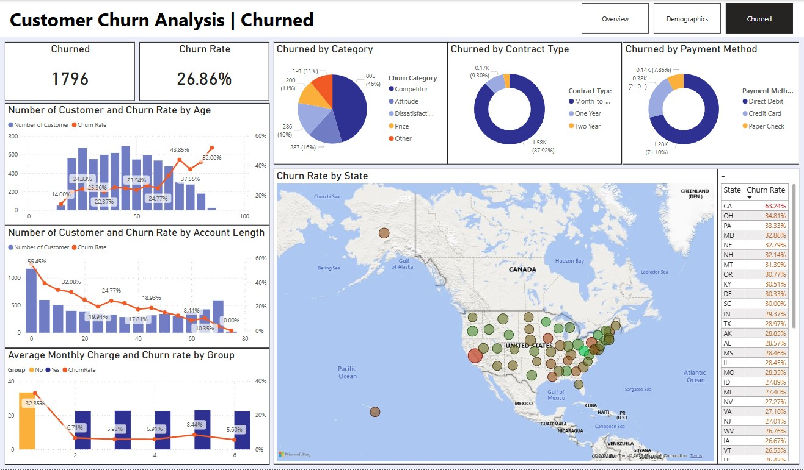

# Customer Churn Analysis Dashboard

This project delivers a **comprehensive Customer Churn Analysis** for **Databel**, a U.S. telecommunications provider, built with **Power BI**. By integrating customer usage, demographic, and transaction data, the dashboard uncovers key churn drivers and supports data‑driven retention strategies.

---

## 📌 Table of Contents
1. [Introduction](#introduction)  
2. [Business Objective](#business-objective)  
3. [Dataset Overview](#dataset-overview)  
4. [Data Preparation](#data-preparation)  
   - [Data Cleaning](#data-cleaning)  
   - [Exploratory Data Analysis (EDA)](#exploratory-data-analysis-eda)  
5. [Report & Dashboard](#report--dashboard)  
   - [Overview Page](#overview-page)  
   - [Demographics Page](#demographics-page)  
   - [Churned Page](#churned-page)  
6. [Key Insights & Business Impact](#key-insights--business-impact)  
7. [How to Use the Report](#how-to-use-the-report)  
8. [Future Improvements](#future-improvements)  
9. [References](#references)  

---

## Introduction
The Customer Churn Analysis Dashboard helps **Databel** identify why customers leave and how to improve retention. Leveraging Power BI, it visualizes churn metrics alongside demographic and usage patterns to drive targeted interventions.

---

## Business Objective
- **Primary Goal**  
  Identify and quantify the factors that drive customer churn, with a target to **reduce churn by 10%** next quarter.  
- **Stakeholders**  
  Marketing, Customer Success, Product Management, and Executive Leadership.  
- **Expected Outcome**  
  Actionable insights to optimize retention campaigns, allocate marketing budget efficiently, and refine service offerings.

---

## Dataset Overview
The analysis uses a consolidated CSV (`databel.csv`) containing:

| Field                    | Description                                                  |
|--------------------------|--------------------------------------------------------------|
| CustomerID               | Unique customer identifier                                   |
| ChurnLabel               | “Yes” if churned, “No” otherwise                             |
| AccountLength            | Subscription duration in months                              |
| State                    | U.S. state of the customer                                   |
| Gender                   | Customer gender                                              |
| Age                      | Customer age                                                |
| NumCustomersInGroup      | Number of customers in the same household/group              |
| ContractType             | Month-to-Month, One Year, Two Year                           |
| PaymentMethod            | Direct Debit, Credit Card, Paper Check                       |
| MonthlyCharge            | Monthly subscription fee                                     |
| ChurnCategory            | High-level churn reason (e.g., Competitor, Price)            |
| ChurnReason              | Detailed churn reason text                                   |

---

## Data Preparation

### Data Cleaning
- **Duplicates & Nulls**: Removed duplicate rows and records with missing `CustomerID` or `ChurnLabel`.  
- **Imputation**: Filled missing `MonthlyCharge` and `AccountLength` with segment medians.  
- **Standardization**: Unified categorical values (e.g., `State`, `ContractType`) for consistency.

### Exploratory Data Analysis (EDA)
- **Distributions**: Plotted histograms for `AccountLength`, `MonthlyCharge`, and `Age`.  
- **Outlier Detection**: Used box plots to identify and review extreme values.  
- **Correlation Analysis**: Generated a correlation matrix to detect multicollinearity among numeric features.

---

## Report & Dashboard

### Overview Page
- **KPIs**: Total Customers, Number Churned, Churn Rate.  
- **Visuals**:  
  - Bar chart of churn reasons by percentage.  
  - Pie charts for churn by category and contract type.  
  - U.S. map showing churn rate by state.  
- **Explanation**  
  Provides an executive snapshot of overall churn metrics and geographic hotspots.

> 

---

### Demographics Page
- **Metrics**: Total Customers by Age, Gender, Contract Type, Payment Method.  
- **Visuals**:  
  - Age distribution histogram.  
  - Pie charts for gender, contract type, and payment method.  
  - Map and table of customer counts by state.  
- **Explanation**  
  Highlights demographic segments most at risk of churn and identifies target groups for retention campaigns.

> 

---

### Churned Page
- **Metrics**: Number Churned, Churn Rate.  
- **Visuals**:  
  - Bar & line charts of churn rate by age and account length.  
  - Bar chart of average monthly charge vs. churn rate.  
  - Pie charts for churned by category, contract type, and payment method.  
  - Map and table of churn rate by state.  
- **Explanation**  
  Delivers deep insights into which customer profiles and behaviors correlate most strongly with churn.

> 

---

## Key Insights & Business Impact
- **Top Churn Drivers**: Competitor offers and price sensitivity account for ~33% of churn.  
- **High-Risk Segments**: Customers with <6 months tenure and those on month-to-month contracts exhibit the highest churn rates (>50%).  
- **Geographic Focus**: California and Ohio show the highest state-level churn rates (>30%), indicating regions for targeted retention efforts.  
- **Business Impact**: By addressing identified drivers and focusing on high-risk segments, Databel can potentially reduce churn by 10–15% and improve customer lifetime value.

---

## How to Use the Report
1. **Download** the `customer_churn_report.pbix` file.  
2. **Open** in **Power BI Desktop**.  
3. Use the **Overview**, **Demographics**, and **Churned** tabs to navigate insights.  
4. Apply **date** and **region** filters to customize the analysis.

---

## Future Improvements
- Integrate **customer support tickets** to enrich churn drivers analysis.  
- Deploy **machine learning models** (e.g., logistic regression, random forest) for individual churn prediction.  
- Enable **real‑time data refresh** and mobile‑optimized dashboards.  
- Add **What‑If parameters** for interactive scenario planning.

---

## References
- Internal CRM and transactional datasets.  
- Industry research on churn prediction and retention strategies.  
- Power BI documentation and best practices.  
